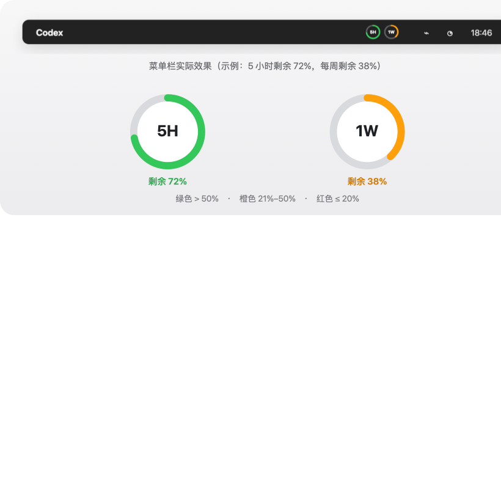

# Codex Usage Bar

原生 macOS 菜单栏应用，用两个圆环显示 Codex 的 5 小时窗口和每周窗口剩余额度。



## 功能

- `5H` 圆环显示 5 小时窗口剩余额度
- `1W` 圆环显示每周窗口剩余额度
- 点击菜单栏图标查看精确百分比、重置时间和最近更新时间
- 支持 1、5、10、15 或 30 分钟刷新频率
- 支持立即刷新、登录时启动和命令行单次读取
- 51% 以上显示绿色，21%–50% 显示橙色，20% 以下显示红色

数据通过本机 Codex 的只读 `account/rateLimits/read` 接口获取。应用不读取、复制或保存登录令牌。

## 运行要求

- macOS 13 或更高版本
- 已安装并登录 ChatGPT/Codex 桌面应用，或已安装可用的 Codex CLI
- Apple Command Line Tools，用于本地构建

## 快速开始

构建并执行离线自检：

```sh
make check
```

安装到 `~/Applications` 并设置登录时启动：

```sh
make install
```

也可以直接运行：

```sh
./build.sh
./install.sh
```

构建结果位于 `build/Codex Usage Bar.app`。

## 数据验证

读取当前账户额度：

```sh
make print-once
```

只验证内置数据解析逻辑：

```sh
./build/Codex\ Usage\ Bar.app/Contents/MacOS/CodexUsageBar --self-test
```

## 项目结构

```text
.
├── Sources/CodexUsageBar/    Swift 源码
├── Resources/Info.plist      应用元数据
├── docs/                     UI 预览与架构说明
├── build.sh                  应用构建脚本
├── install.sh                安装与登录启动脚本
├── Makefile                  常用开发命令
└── CHANGELOG.md              版本记录
```

## Codex CLI 路径

应用会自动查找 ChatGPT/Codex 桌面应用内置的 Codex，以及 Homebrew 常用安装路径。使用其他位置时，可在启动环境中设置：

```sh
export CODEX_CLI_PATH=/path/to/codex
```

## 刷新设置

默认每 5 分钟刷新一次。点击菜单栏图标，在“刷新频率”中选择新的间隔；设置会保存在 macOS 用户偏好中。

## 开发

提交修改前运行：

```sh
make check
```

更多实现说明见 [`docs/ARCHITECTURE.md`](docs/ARCHITECTURE.md)。
